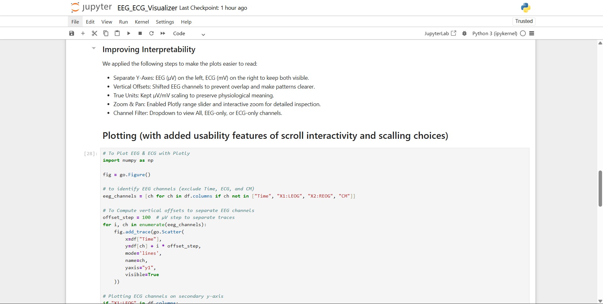
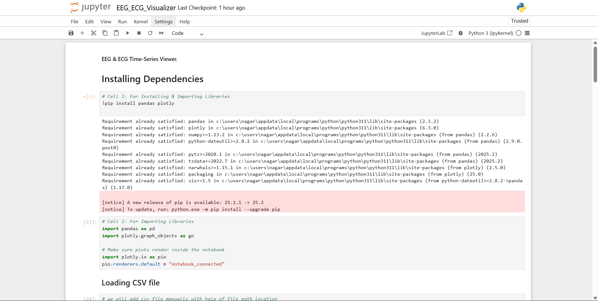
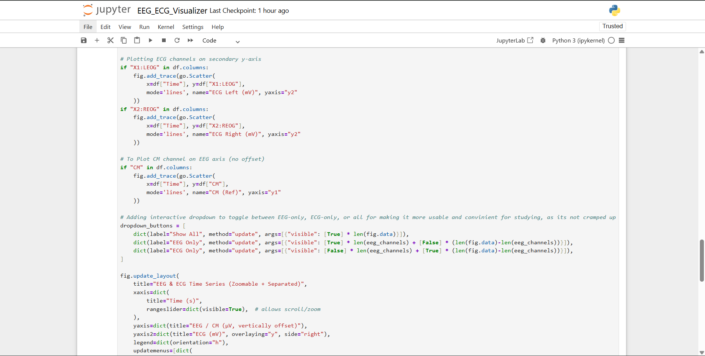
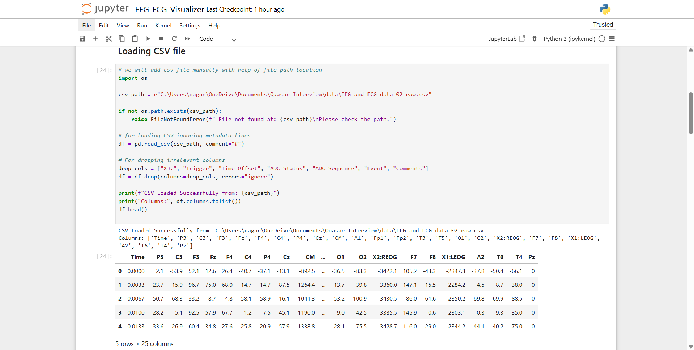
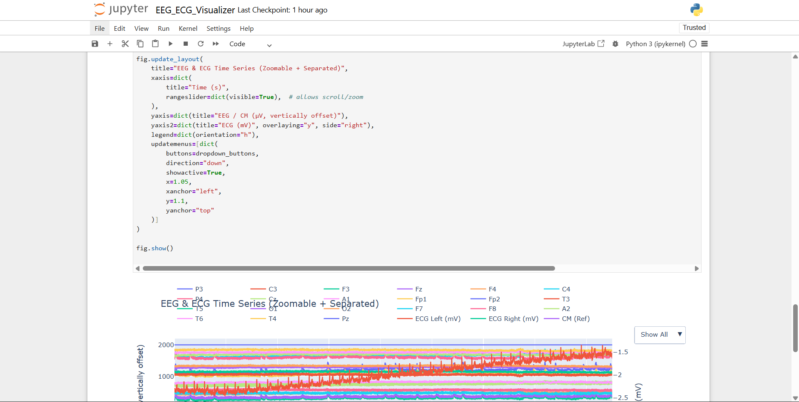
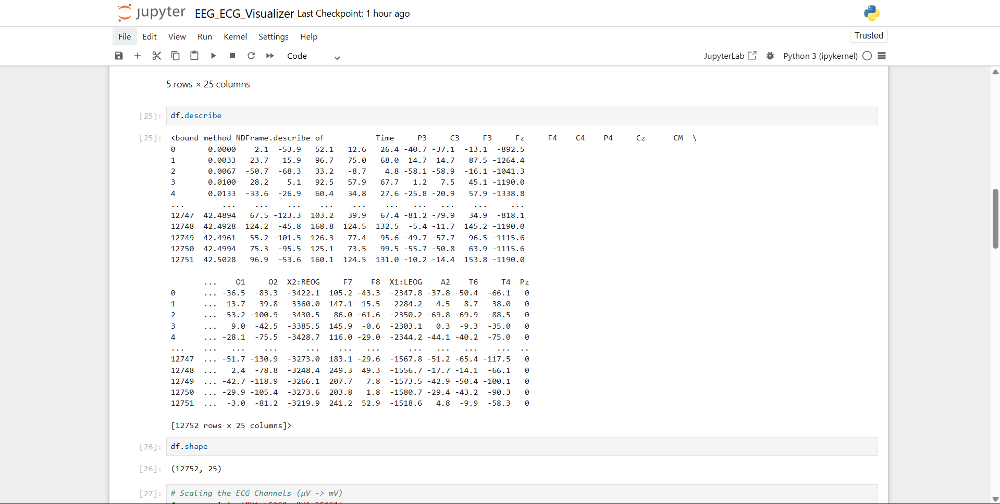
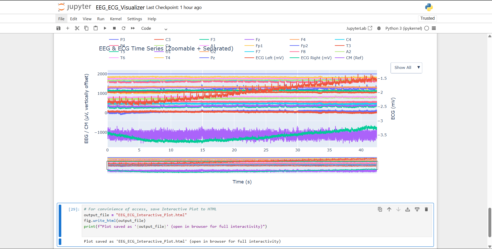
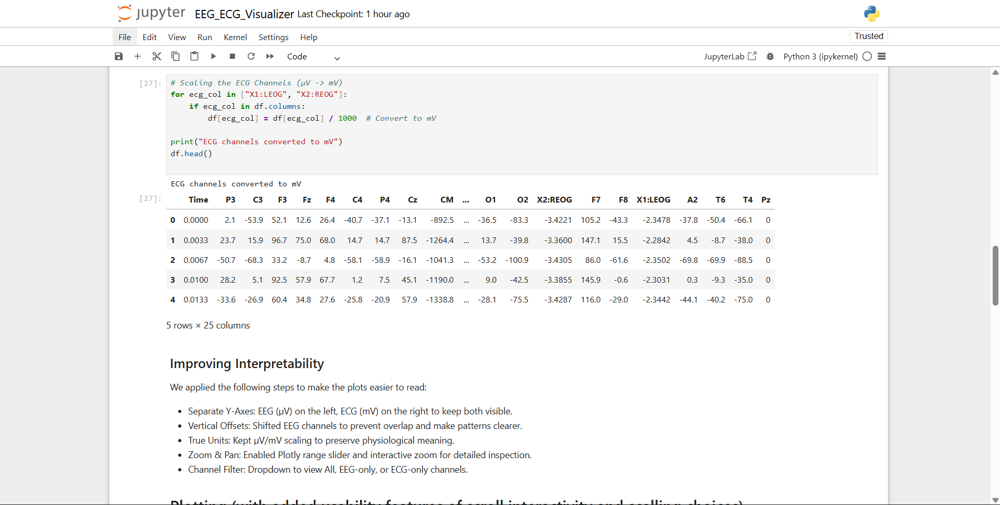

# EEG & ECG Time-Series Viewer


## Project Overview
This project provides an interactive viewer for EEG and ECG signals.  
It allows users to scroll, zoom, and explore multiple channels over time while handling scaling differences between EEG (µV) and ECG (mV) signals.

---

## How to Run

### 1. Install Dependencies
Make sure you have Python installed (3.8+ recommended). Then install required packages:

```bash
pip install pandas plotly numpy
2. Open the Notebook
Place your CSV file (e.g., EEG and ECG data_02_raw.csv) in a known directory.

Open the Jupyter Notebook:

bash
Copy code
jupyter notebook EEG_ECG_Visualizer.ipynb
3. Set CSV Path
In the notebook, edit the path in Cell 3:

python
Copy code
csv_path = r"C:\path\to\your\EEG and ECG data_02_raw.csv"
4. Run All Cells
The notebook will:

Load and clean the data.

Convert ECG channels to mV.

Plot EEG & ECG signals interactively with scroll, zoom, and channel selection.

Design Choices
Separate Y-Axes:

EEG channels (µV) on the left axis.

ECG channels (mV) on the right axis.

Ensures both signal types remain interpretable.

Vertical Offsets for EEG:

EEG channels are stacked to avoid overlap and make waveforms clear.

Interactive Plot:

Scrollable range slider, zoom/pan, and hover mode to inspect data precisely.

Dropdown menu for toggling between All / EEG-only / ECG-only channels.

True Units Maintained:

No normalization by default to preserve physiological meaning.

## Screenshots in the files section

## GIF also in the Files section

```










